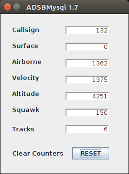
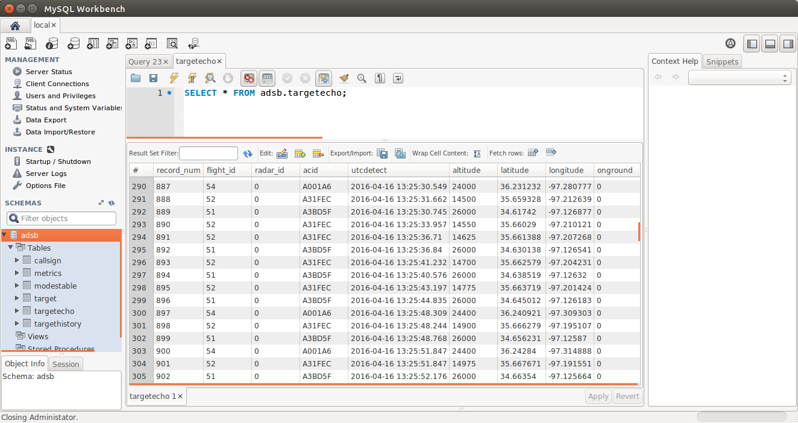

#### ADSBMySQL
This application connects to TCP Port 30003 (or configured alternate port) which is the common Basestation compatible
port number for ADS-B and Mode-S output data. It's a pretty simple program. Purely a hobby endeavor. This TCP port does not have any fancy data being output, it is just the most common data - heading, altitude, speed, etc.

The database is updated by a configurable (1 to 13 seconds) time. Aircraft transmit their position every second, but in most cases it isn't necessary to have that resolution. By default I set 3 seconds, which is adequate for me. In the Track Display program, it reads the database every second, which if you set in 13 seconds here, not a lot of its queries will have new data, but reading is not as database intensive as writing. Every write will update several tables.

This update time can be considered a simulated Revolutions Per Minute (RPM) of a rotating radar antenna. A long range radar usually updates every 10 to 12 seconds (6 or 5 RPM), while an airport radar will update every 2.5 seconds (24 RPM). A surface to air missile system will update every second (for comparisons).

Included is a config file that the program reads on startup. This contains the database table name, and the login credentials. There is also an export of the database so you can initialize the database.

Basically you create a directory to put the ```ADSBMySQL.jar``` file in. Then create a ```lib``` directory and put the database ODBC connector file in there. The program was compiled using this particular file, so don't upgrade it without recompiling (I use Netbeans IDE).

Add the config file in the main directory and you are ready to go after you set up the MySQL database.

If you comment out the GUI off config, a GUI will be displayed and it basically shows the data counts being received by the Basestation TCP port. Otherwise this program does nothing but work in the background storing the data.



The database is designed so that as new targets come in, their Mode-S ICAO number is added to the ```modestable``` table, and the positions saved in the ```target``` and ```targetecho``` table. Sooner or later this aircraft will land or fade-out, and the database will move it to the ```history``` table. If it pops up again, then it is issued a new flight number. The data in the ```target``` table then, is the current data. When those targets fade or land, they are deleted from this table, and moved to the ```targethistory``` table.

There is also a ```metrics``` table that shows how much data has been processed every 30 seconds, and a ```metar``` table to record temperature, wind, and pressure altitude information for airports selected in the config file.

Commandline: ```java -jar ADSBMySQL.jar 2>&1 >>errorlog.txt &``` on Linux and just double click the jar file on Windows.

##### Time and Date Stamps
All data is recorded in UTC time. This is so multiple receivers in different time zones all record to the same time reference. Although, the times may differ if systems are not synchronized to GPS.

##### Aircraft Registration
Currently it only updates the registration (N-Number) for USA aircraft, as they are assigned 1:1, and I don't have any info on other countries. I don't do an Internet lookup, as most sites don't allow it for free.

##### Port 30003 Compatibility
Alas, there are some pretty crummy Port 30003 implementations out there. ```Planeplotter``` for instance doesn't output the Booleans (alert, ident, emergency, etc). These are always ```0```. The program ```dump1090``` which along with a $20 receiver will suck data out of the atmosphere and drop it into your database. I currently use ```modesmixer2``` with my Mode-S Beast receiver available from http://xdeco.org/
```
sudo beast-splitter --serial /dev/beast --fixed-baud 3000000 --listen 30005:R
~/modesmixer2 --location 34.382901:-98.423287 --outServer msg:30003 --inConnect 127.0.0.1:30005
```
Using the ```--web 9090``` or desired port, you can also watch the statistics. You can also use ```modesdeco2``` with the RTL SDR receiver:
```
nohup sudo ~/modesdeco2 --location 34.382901:-98.423287 --msg 30003&
```
##### Sample Database View
Here's a sample of what the data might look like.



